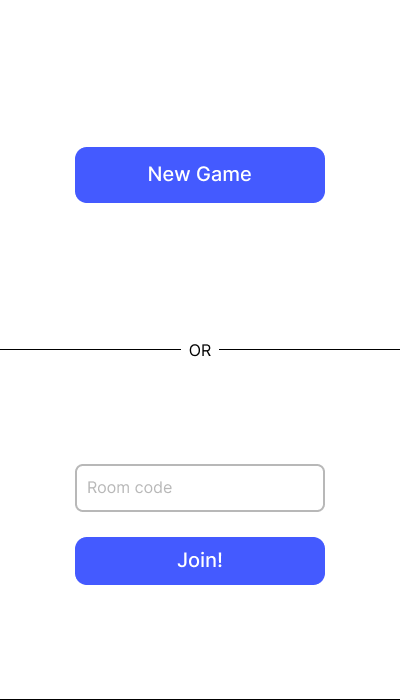
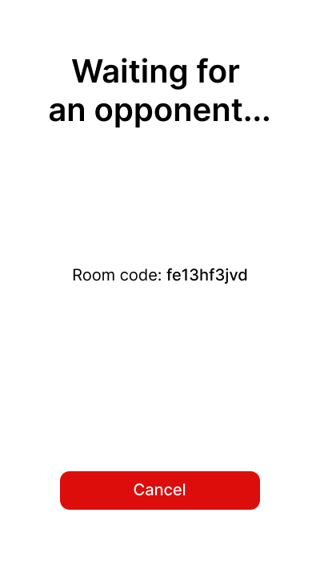
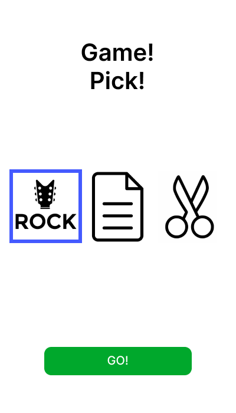
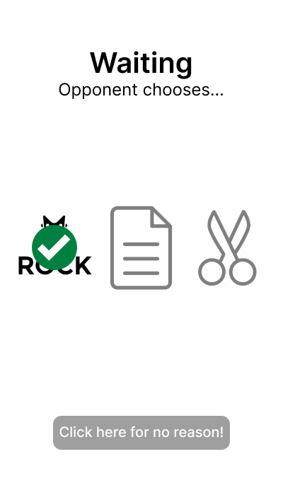
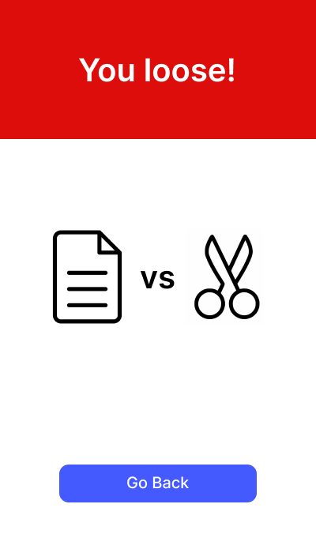
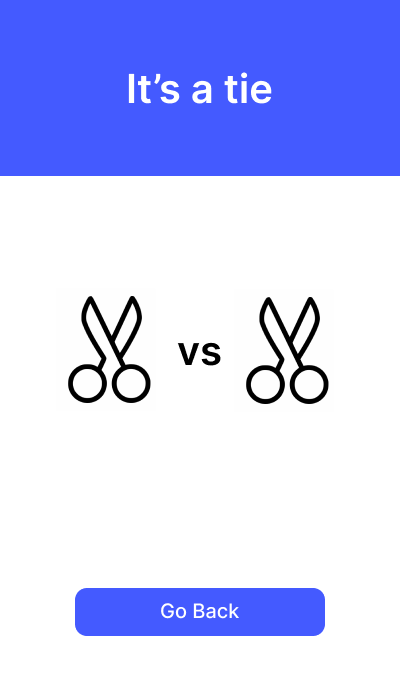
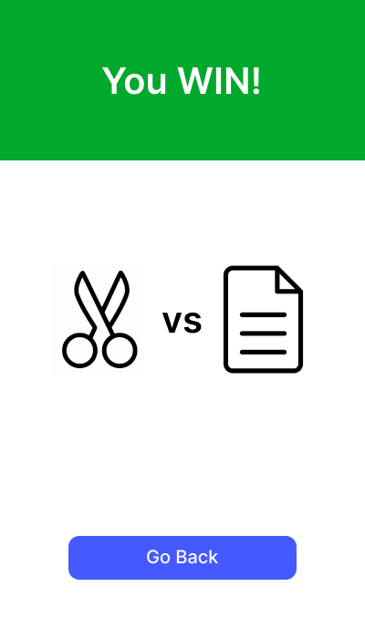

# Камень-Ножницы-Бумага: SocketIO-X Edition

### Описание
Написать с использованием стека [репозитория тестового задания](https://github.com/niqzart/ffs-test-task) бэкенд для игры камень-ножницы-бумага. Создать нужно только модели БД, контроллеры для ReST (если нужно) и SocketIO, ничего по шаблонам и фронтенду делать не нужно

### Рекомендации
Для socketio можно использовать [python-socketio](https://python-socketio.readthedocs.io/en/latest/server.html) или [flask-socketio](https://flask-socketio.readthedocs.io/en/latest/) в чистом виде. А можно (рекомендую) ускорить свою работу за счёт использования [flask-fullstack](https://github.com/niqzart/flask-fullstack), у которой, к сожалению, мало документации, зато есть [недо-туториал](https://github.com/xi-effect/xi.backend/pull/110) и легко найти примеры использования в коде проекта [xi.backend](https://github.com/xi-effect/xi.backend)

### Макеты для понимания
Игра максимально простая. Её начальный экран выглядит примерно так:

При создании игры бэкенд должен выдать код этой игры, чтобы в неё мог вступить второй игрок, а также чтобы фронтенд мог показать этот экран:

Когда второй игрок заходит в игру, оба видят экран выбора следующего хода:

Первый игрок, сделавший ход, будет дожидаться хода оппонента на этом экране:

Когда второй наконец совершит свой ход, оба игрока перейдут на финальный экран с результатами игры:

| Lost                        | Tie                       | Win                       |
|-----------------------------|---------------------------|---------------------------|
|  |  |  |

### Креативность
Креативность приветствуется. Задание специально изложено через макеты, чтобы точные архитектурные решения были возложены на решающего. Вокруг интерфейсов можно фантазировать, предполагать, что под капотом должен делать фронтенд, чтобы было удобнее реализовать бэк. Работает всё, что можно обосновать, ревью задания будет происходить вместе с решившим, чтобы дать шанс защитить всё что угодно
